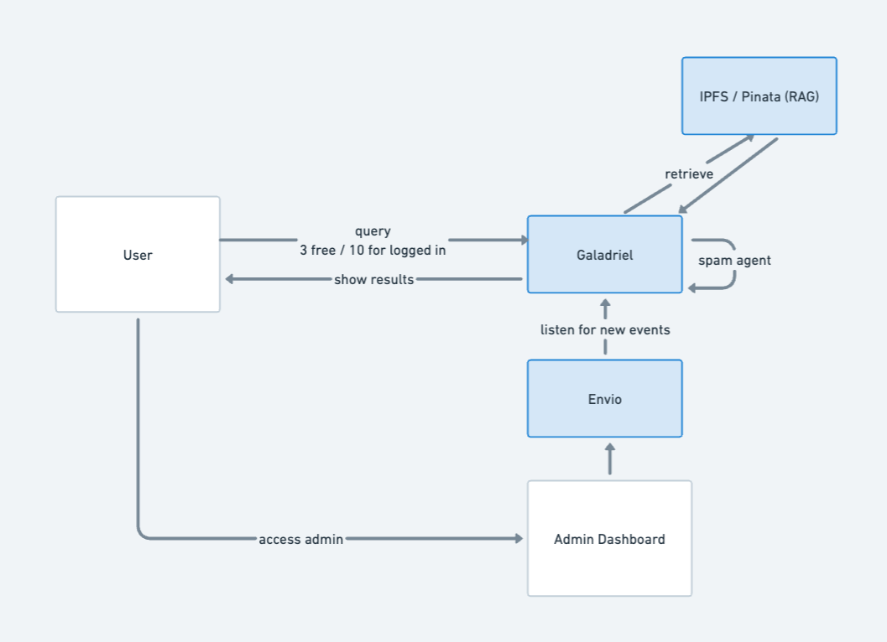

# TeckDoc - The web3 x AI documentation

🌐 Demo: https://teckdoc-smart-search.vercel.app

## Description

Teckdoc is a simple open source documentation using decentralized AI to reduce the cost of web2 alternatives.
It also includes an admin dashboard to learn from user interactions.


## Features

- **Web3Auth Login:** 3 free queries and 10 free credits for logged in users.
- **Admin dashboard:** Using Envio Protocol to learn from user interactions.
- **Galadriel Protocol:** Onchain AI with RAG and an anti-spam agent.
- **Multiple Demos:** Multiple demos to choose from: Nillions, Blockless, Avail ...

## Flow Overview



## Getting Started

1) Clone the repository:

```sh
git clone https://github.com/bertrandbuild/teckdoc.git
```

2) Install your .mdx files in the `./smart-search/contents/docs` folder
It requires manual update of the links in the `./smart-search/app` folder and the routes in the `./smart-search/lib/routes-config.ts` file

3) Deploy the RAG 
Follow the instructions in the [RAG README](./smart-search/utils/rag-tools/README.md)

4) Deploy the contracts
Follow the instructions in the [contracts README](./smart-search/contracts/README.md)

5) Fill .env with your variables

6) Install dependencies:
```sh
cd teckdoc
npm install
```

7) Running the App

```sh
npm start
```

The app will be running on `http://localhost:3000`.

## Support

If you need help, please contact me on twitter [@bertrandbuild](https://x.com/bertrandbuild)
